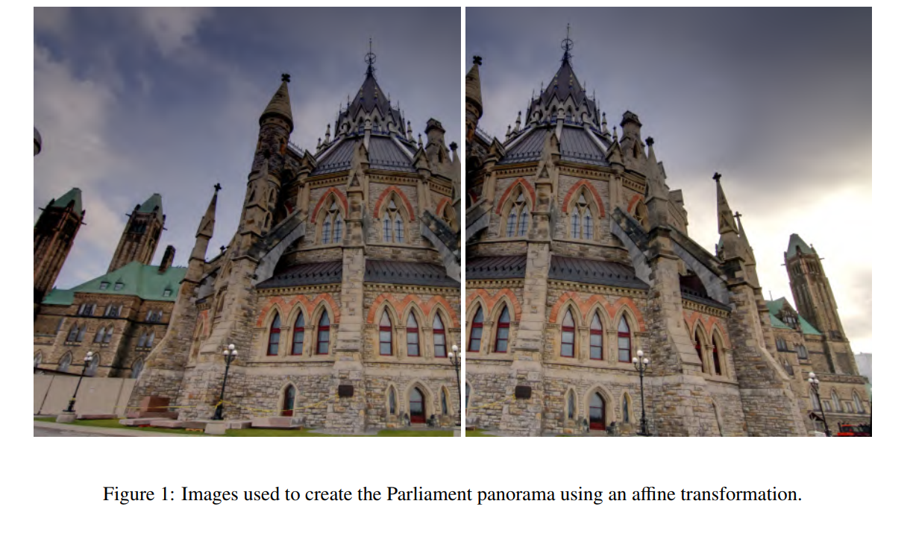
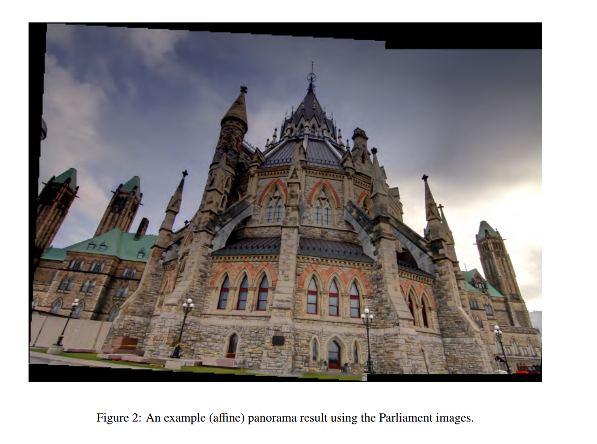

## RANSAC-based Image Stitching

The following code constructs mosaic/panoramas based on affine and homography transformation given two to three images with some overlapping points. The project uses Python, PyTorch, Kornia, Scipy, CV2, MatplotLib and Numpy libraries.

